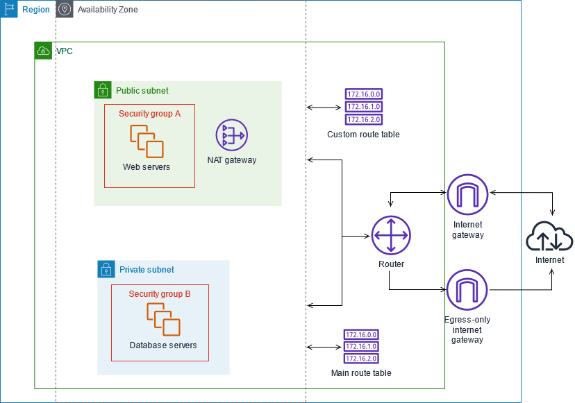
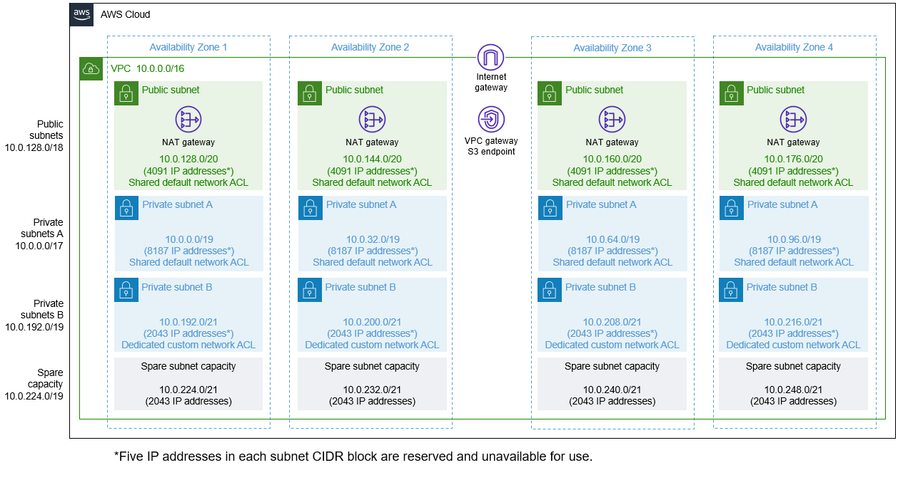
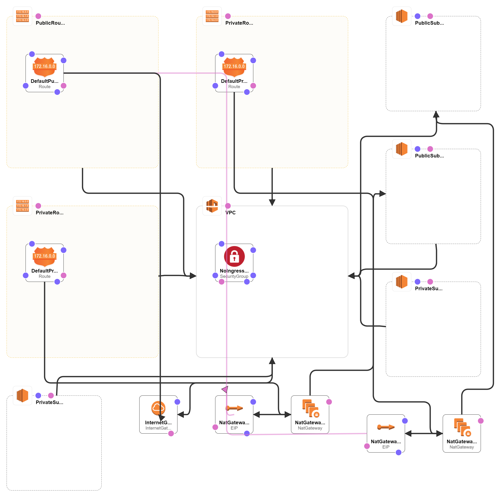
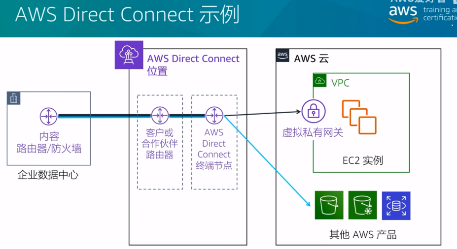

# aws product learn
<!-- TOC -->

- [aws product learn](#aws-product-learn)
    - [AWS products](#aws-products)
    - [EC2实验](#ec2%E5%AE%9E%E9%AA%8C)
    - [S3](#s3)
    - [VPC](#vpc)
    - [VPC实验](#vpc%E5%AE%9E%E9%AA%8C)
    - [CloudWatch](#cloudwatch)
    - [ELB Elastic Load Balancing](#elb-elastic-load-balancing)
    - [RDS Relational Database Service](#rds-relational-database-service)
    - [DynamoDB适用场景](#dynamodb%E9%80%82%E7%94%A8%E5%9C%BA%E6%99%AF)
    - [其它专门构建的数据库服务](#%E5%85%B6%E5%AE%83%E4%B8%93%E9%97%A8%E6%9E%84%E5%BB%BA%E7%9A%84%E6%95%B0%E6%8D%AE%E5%BA%93%E6%9C%8D%E5%8A%A1)
    - [Redshift OLAP On-Line Analytical Processing](#redshift-olap-on-line-analytical-processing)
    - [CloudFormation](#cloudformation)
    - [Elastic Beanstalk代码即服务](#elastic-beanstalk%E4%BB%A3%E7%A0%81%E5%8D%B3%E6%9C%8D%E5%8A%A1)
    - [Diretc Connect](#diretc-connect)
    - [安全性，身份认证与合规性](#%E5%AE%89%E5%85%A8%E6%80%A7%E8%BA%AB%E4%BB%BD%E8%AE%A4%E8%AF%81%E4%B8%8E%E5%90%88%E8%A7%84%E6%80%A7)

<!-- /TOC -->

## AWS products
  [products](./products/README.md)

## EC2实验
    创建
      aws cloudformation deploy --stack-name ec2-simple --template-file ./example/ec2/EC2InstanceWithSecurityGroupSample.yaml
    删除
      aws cloudformation delete-stack --stack-name ec2-simple
    测试
      ssh -i C:\Users\Administrator\OneDrive\study\aws-product-learn\aws-product-learn.pem root@13.125.202.87
    遇到问题
      模板中LatestAmiId不能更换，想换成CentOs或Ubuntu系统

## S3
    最大单个文件5TB
    持久性11个9
    S3 Glacier不需要立即访问但需要灵活检索

## VPC
    VPC可以跨az
    VPC不可以跨regions
    S3不属于VPC内部

  - 典型VPC网络架构

    

  - 高可用VPC网络架构

    

  - CloudFormation模板VPC

    

## VPC实验
    创建
      aws cloudformation deploy --stack-name vpc-simple --template-file ./example/vpc/codebuild-vpc-cfn.yaml
    删除
      aws cloudformation delete-stack --stack-name vpc-simple
    测试
      创建VPC
      EC2绑定VPC
      测试EC2出口，入口流量是否正常
    遇到问题
      SSL validation failed for https://cloudformation.ap-northeast-2.amazonaws.com/ EOF occurred in violation of protocol (_ssl.c:1129)
        关掉代理就好
    实验过程知识点
      AWS-VPC-Egress 识别从所有 VPC 到互联网网关、对等连接、VPC 终端节点、VPN 和 Transit Gateway 的出口路径。
      AWS-VPC-Ingress 识别从互联网网关、对等连接、VPC 服务终端节点、VPN 和 Transit Gateway 进入 VPC 的入口路径。
      AWS-IGW-Egress 识别从所有网络接口到互联网网关的出口路径。
      All-IGW-Ingress 识别从互联网网关到所有网络接口的入口路径。

## CloudWatch
    默认监控指标
      CPU
      IO
      Network
      Memery默认不监控，要手动开户

## ELB Elastic Load Balancing
    ELB
      高可用性
      可以检测运行状态
      SSL/TLS终止
      运行监控
    2代三类产品
      ALB Application Load Balancing
        LV7
      NLB Network Load Balancing
        LV4
        100W级并发
        2019年支持udp
        
## RDS Relational Database Service
    支持主流数据库
      Amazon Aurora
      Postgresql
      MariaDB
      Oracle
      MySql
      SqlServer
    特点
      轻松扩展
      自动软件修复
      自动备份 默认开户自动备份策略
      数据库快照 基于EBS块存储snapshop
      多regions AZ部署
      自动主备更换 master replica(slave歧视)
      静态和传输中加密 数据，log加密

## DynamoDB适用场景
    无服务器Web应用程序
    微服务数据存储
    移动后端
    广告技术
    游戏
    物联网Iot

## 其它专门构建的数据库服务
    Amazon Redshift 快速、可扩展的数据仓库LDAP
    Amazon DouctmentDB 与MongoDB兼容的数据库
    Amazon Neptune图形数据库

## Redshift OLAP On-Line Analytical Processing
    机器学习
    大规模并行查询
    列式存储
    BI数据分析决策

## CloudFormation
    IAC Infrastructure As Code
    云基础设施建模并对其进行预置

## Elastic Beanstalk代码即服务
    简单快速
    资源预置
    负载均衡
    自动扩展
    监控，日志记录和跟踪
    各种应用程序部署选项

## Diretc Connect
    专线
  

## 安全性，身份认证与合规性
    AWS Artifact
    AWS Certificate Manager
    Amazon Cloud Directory
    AWS CloudHSM
    Amazon Cognito
    AWS Directory Service
    AWS Firewall Manager
    Amazon GuardDuty
    AWS Identity and Access Management
    Amazon Inspector
    AWS Key Management Service
    Amazon Macie
    AWS Organizations
    AWS Shield
    AWS Scerts Manater
    AWS Single Sign-On
    AWS WAF